# 🔍 SKYWATCH — Akıllı Yüz Tanıma Tabanlı Sabıka Sorgulama ve Kişi Arama Sistemi

## 📋 Proje Özeti

> **Amaç:** Güvenlik kameralarından gelen canlı görüntüdeki kişilerin yüzlerini analiz edip sabıka veritabanında sorgulayan, **kişileri frameler arası ve kameralar arası takip eden**, hareket analizleriyle davranış değerlendirmesi yapan, ayrıca aranan bir kişinin fotoğrafı yüklendiğinde seçilen kameralar veya bölgeler üzerinden hedef arama yapabilen **akıllı güvenlik platformu** geliştirmektir.

> Bu sistem **iki modda** çalışır: **pasif gözetleme** (sürekli sabıka tarama + takip + hareket analizi) ve **aktif arama** (hedef kişiyi kameralarda bulma + rota takibi).

---

## 🎯 Projenin Yenilikçi Yönleri

| # | Yenilik | Mevcut Sistemlerden Farkı |
|---|---------|--------------------------|
| 1 | **Çift Modlu Çalışma** | Pasif sabıka tarama + aktif kişi arama tek platformda |
| 2 | **Bölge/Kamera Bazlı Arama** | Operatör harita üzerinden kamera veya bölge seçerek arama yapabilir |
| 3 | **Gerçek Zamanlı Sabıka Eşleştirme** | Kamera görüntüsündeki her yüz anında veritabanıyla karşılaştırılır |
| 4 | **DeepSORT Tracking** | Kişilere sabit ID atanır, frameler arası tutarlı takip sağlanır |
| 5 | **Çoklu Kamera Arası Takip** | Kişi bir kameradan çıkıp diğerine girdiğinde aynı kişi olarak tanınır |
| 6 | **Hareket Analizi** | Hız, yön, bekleme süresi, rota analizi ile davranış değerlendirmesi |
| 7 | **Çoklu Kamera Yönetimi** | Tek arayüzden birden fazla kamera izleme ve arama |
| 8 | **Akıllı Bildirim Sistemi** | Sabıkalı veya aranan kişi tespitinde anlık alarm + olay kaydı |

---

## ❗ Mevcut Güvenlik Sistemlerinin Problemleri

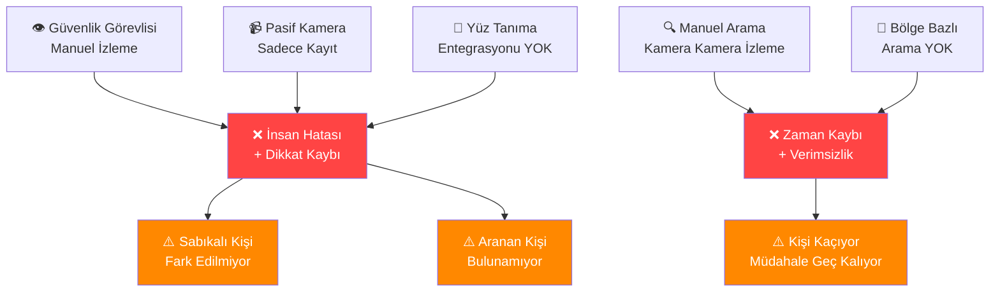

**Bizim çözümümüz:** Otomatik yüz tanıma + sabıka sorgulama + hedefli kişi arama = **SKYWATCH**

---

## 🔄 İki Çalışma Modu

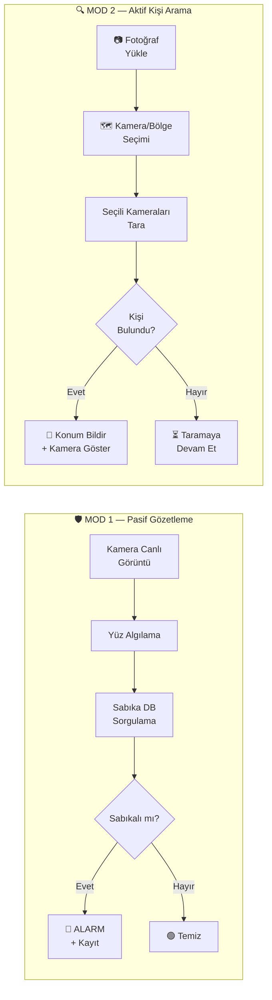

| | Mod 1 — Pasif Gözetleme | Mod 2 — Aktif Arama |
|--|--------------------------|---------------------|
| **Tetikleyici** | Otomatik — kamera açık olduğu sürece çalışır | Manuel — operatör fotoğraf yükler ve başlatır |
| **Kaynak** | Tüm aktif kameralar | Seçilen kamera(lar) veya bölge |
| **Karşılaştırma** | Her yüz → sabıka DB'de ara | Yüklenen fotoğraf → kamera görüntülerinde ara |
| **Çıktı** | Sabıkalı / Temiz / Bilinmeyen | Bulundu (konum + kamera) / Bulunamadı |
| **Süreklilik** | 7/24 kesintisiz | Bulunana kadar veya iptal edilene kadar |

---

## 🏗️ Sistem Mimarisi — 8 Ana Modül

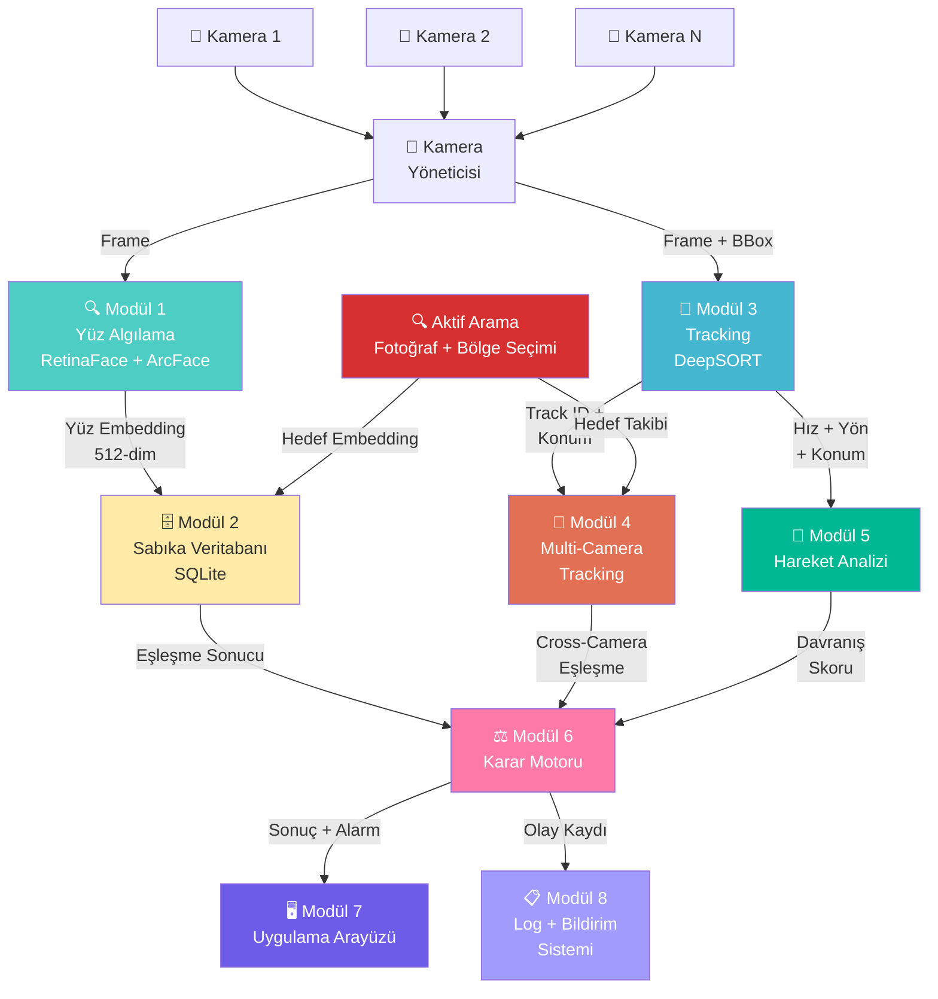

---

## 📐 Modül 1: Yüz Algılama ve Embedding Çıkarma

### Ne Yapıyor?
Kamera görüntüsünden **yüzleri algılar**, hizalar ve her yüzü **512 boyutlu sayısal vektöre** (embedding) dönüştürür.

### Teknoloji
**InsightFace** — RetinaFace (yüz algılama) + ArcFace (yüz embedding)

### İş Akışı

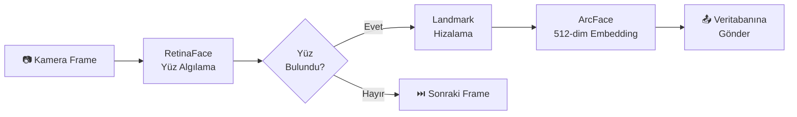

### Yüz Embedding Kavramı

```
Kişi A'nın yüzü  → [0.12, -0.45, 0.78, ..., 0.33]  (512 sayı)
Kişi B'nın yüzü  → [0.89, 0.11, -0.56, ..., -0.22]  (512 sayı)

Cosine Similarity > 0.45 → Aynı kişi ✅
Cosine Similarity < 0.45 → Farklı kişi ❌
```

### Sınıf Yapısı — `src/core/face_analyzer.py`

> ⚠️ **Kod Tekrarı Önleme:** Cosine similarity hesaplaması **yalnızca bu sınıfta** yapılır. Veritabanı modülü embedding döndürür, karşılaştırmayı `FaceAnalyzer.compare()` yapar.

```python
class FaceAnalyzer:
    def __init__(self, config):
        """
        InsightFace modeli yükle (buffalo_l):
        - RetinaFace: yüz algılama
        - ArcFace: yüz embedding çıkarma
        """
        self.app = insightface.app.FaceAnalysis(
            name="buffalo_l",
            providers=['CUDAExecutionProvider', 'CPUExecutionProvider']
        )
        self.app.prepare(ctx_id=0, det_size=(640, 640))
        self.threshold = config.get('similarity_threshold', 0.45)

    def detect_faces(self, frame) -> list[FaceResult]:
        """
        Output: List[FaceResult]
            - bbox: [x1, y1, x2, y2]
            - embedding: np.ndarray (512,)
            - age: int
            - gender: str
            - det_score: float
        """

    def extract_embedding(self, face_image) -> np.ndarray:
        """Tek bir yüz fotoğrafından embedding çıkar (aktif arama modu için)"""

    def compare(self, emb1, emb2) -> float:
        """Cosine similarity: 0.0 - 1.0 — TÜM SİSTEMDE TEK KARŞILAŞTIRMA NOKTASI"""
        return float(np.dot(emb1, emb2) / (np.linalg.norm(emb1) * np.linalg.norm(emb2)))
```

---

## 📐 Modül 2: Sabıka Veritabanı — `src/database/db.py` (Tek Dosya)

> ⚠️ **Kod Tekrarı Önleme:** Mevcut tasarımda `db_manager.py` + `models.py` olarak 2 dosya vardı. SQLite için **tek dosya** yeterli — tüm CRUD ve sorgu işlemleri `db.py` içinde.

### Veritabanı Yapısı (SQLite)

```
CRIMINALS Tablosu (Sabıkalılar):
┌─────────┬──────────────┬────────┬──────────┬─────────────────┬──────────────┬──────────────┐
│ id (PK) │ name         │ gender │ age      │ crime_type      │ danger_level │ status       │
├─────────┼──────────────┼────────┼──────────┼─────────────────┼──────────────┼──────────────┤
│ 1       │ Kişi_A       │ E      │ 35       │ Hırsızlık       │ MEDIUM       │ ARANIYOR     │
│ 2       │ Kişi_B       │ E      │ 28       │ Silahlı Soygun  │ CRITICAL     │ ARANIYOR     │
│ 3       │ Kişi_C       │ K      │ 42       │ Dolandırıcılık  │ LOW          │ SABIKALI     │
└─────────┴──────────────┴────────┴──────────┴─────────────────┴──────────────┴──────────────┘

EMBEDDINGS Tablosu:
┌─────────┬──────────────┬─────────────────────┬──────────────┐
│ id (PK) │ criminal_id  │ embedding (BLOB)    │ added_date   │
├─────────┼──────────────┼─────────────────────┼──────────────┤
│ 1       │ 1            │ [0.12, -0.45, ...]  │ 2026-03-01   │
│ 2       │ 2            │ [0.89, 0.11, ...]   │ 2026-03-01   │
└─────────┴──────────────┴─────────────────────┴──────────────┘

DETECTIONS Tablosu (Tespit Kayıtları):
┌─────────┬──────────────┬────────────┬──────────────┬─────────────────┬──────────────┐
│ id (PK) │ criminal_id  │ camera_id  │ timestamp    │ screenshot_path │ confidence   │
├─────────┼──────────────┼────────────┼──────────────┼─────────────────┼──────────────┤
│ 1       │ 2            │ CAM_01     │ 2026-03-04   │ /shots/d1.jpg   │ 0.91         │
│ 2       │ 2            │ CAM_03     │ 2026-03-04   │ /shots/d2.jpg   │ 0.87         │
└─────────┴──────────────┴────────────┴──────────────┴─────────────────┴──────────────┘

SEARCH_REQUESTS Tablosu (Arama Talepleri):
┌─────────┬─────────────────┬──────────────────┬──────────────┬──────────┬──────────────┐
│ id (PK) │ photo_path      │ target_cameras   │ status       │ started  │ found_at     │
├─────────┼─────────────────┼──────────────────┼──────────────┼──────────┼──────────────┤
│ 1       │ /search/s1.jpg  │ CAM_01,CAM_02    │ FOUND        │ 15:30    │ CAM_02 15:42 │
│ 2       │ /search/s2.jpg  │ BÖLGE_A          │ SEARCHING    │ 16:00    │ —            │
└─────────┴─────────────────┴──────────────────┴──────────────┴──────────┴──────────────┘
```

### Veritabanı Fonksiyonları

> ⚠️ **Önemli:** `get_all_embeddings()` embedding döndürür ama **karşılaştırma yapmaz**. Karşılaştırma `FaceAnalyzer.compare()` tarafından yapılır. Bu sayede cosine similarity kodu **tek yerde** kalır.

```python
class Database:
    """Tüm veritabanı işlemleri — tek sınıf, tek dosya."""

    def add_criminal(self, name, embedding, crime_type, danger_level, photo) -> int:
        """Sabıkalı kişi ekle, criminal_id döndür"""

    def get_all_embeddings(self) -> list[tuple[int, np.ndarray]]:
        """Tüm embedding'leri döndür → [(criminal_id, embedding), ...]
        Karşılaştırma BURADA YAPILMAZ — FaceAnalyzer.compare() yapar"""

    def log_detection(self, criminal_id, camera_id, screenshot_path, confidence):
        """Tespit kaydı oluştur"""

    def create_search_request(self, photo_path, target_cameras) -> int:
        """Yeni arama talebi oluştur"""

    def update_search_status(self, search_id, status, found_camera=None):
        """Arama durumunu güncelle"""

    def get_criminal_history(self, criminal_id) -> dict:
        """Kişinin tüm tespit geçmişi"""

    def get_all_wanted(self) -> list:
        """Tüm arananların listesi"""
```

---

## 📐 Modül 3: Tracking (DeepSORT)

### Ne Yapıyor?
Tespit edilen kişilere **benzersiz ID** atar ve frameler arası **tutarlı takip** sağlar. Aynı kişinin her frame'de tekrar tekrar DB'de aranmasını engeller.

### Neden Tracking Gerekli?

| Problem | Tracking Olmadan | Tracking İle |
|---------|-------------------|-------------|
| Her frame'de yeni ID | Kişi sayısı yanlış, DB spam | Sabit ID → doğru sayım |
| Sabıka sorgusu | Her frame tekrar sorgu (30x/sn) | İlk frame'de bir kez sorgu |
| Hız hesabı | Mümkün değil | Piksel/frame hız |
| Yön takibi | Mümkün değil | Hareket vektörü |
| Alarm yönetimi | Aynı kişi için sürekli alarm | Tek alarm, sürekli takip |

### DeepSORT Çalışma Mantığı

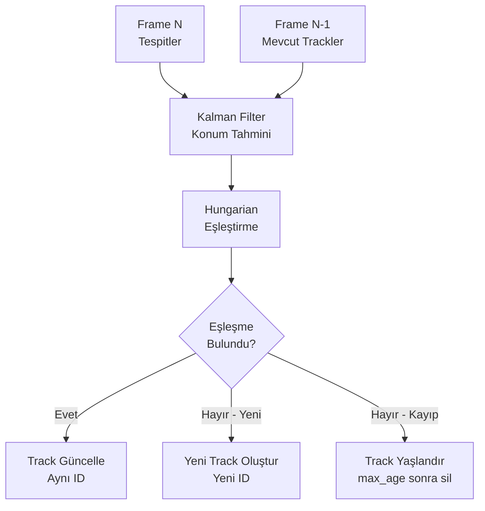

### Track Çıktısı

```python
class Track:
    track_id: int           # Benzersiz kişi ID
    bbox: list              # [x1, y1, x2, y2] konum
    velocity: float         # Piksel/frame hız
    direction: tuple        # Hareket yönü (dx, dy)
    age: int                # Kaç frame'dir takip ediliyor
    face_embedding: np.ndarray  # Yüz embedding (varsa)
    criminal_match: MatchResult # Sabıka eşleşme sonucu
    camera_id: str          # Hangi kamerada
```

---

## 📐 Modül 4: Multi-Camera Tracking (Kameralar Arası Takip)

### Ne Yapıyor?
Kişi bir kameradan çıkıp başka bir kameraya girdiğinde, **yüz embedding karşılaştırması** ile aynı kişi olduğunu anlar ve **global ID** atar.

### Çalışma Mantığı

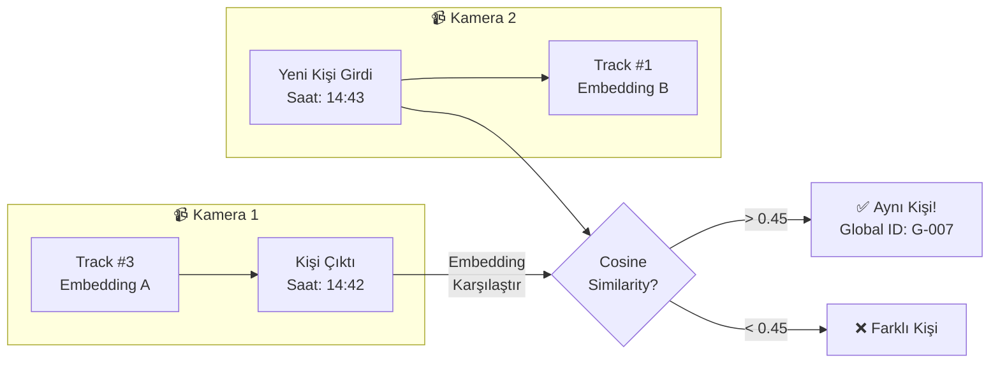

### Cross-Camera Eşleştirme Mantığı

```python
class CrossCameraTracker:
    def __init__(self, config):
        self.global_tracks = {}     # Global ID → kişi bilgisi
        self.camera_exits = {}      # Kameradan çıkan kişilerin embedding'leri

    def on_track_exit(self, camera_id, track):
        """Kişi kameradan çıktığında embedding'i kaydet"""

    def on_new_track(self, camera_id, track) -> int | None:
        """Yeni kişi girdiğinde, çıkan kişilerle karşılaştır"""

    def get_person_route(self, global_id) -> list:
        """
        Kişinin rota geçmişi:
        [CAM_01 14:40] → [CAM_03 14:43] → [CAM_05 14:47]
        """

    def get_last_seen(self, global_id) -> dict:
        """Kişi en son nerede, ne zaman görüldü?"""
```

### Arama Modunda Kullanım

Aktif arama sırasında kişi bulunduğunda:
1. Bulunduğu kameranın **komşu kameralarını** otomatik tara
2. Kişinin hareket yönüne göre **sıradaki kamerayı tahmin et**
3. Rota geçmişini oluştur → *"Kişi CAM_01 → CAM_03 → CAM_05 rotasında ilerliyor"*

---

## 📐 Modül 5: Hareket Analizi (Movement Analysis)

### Ne Yapıyor?
Tracking verilerinden kişinin **hız, yön, bekleme süresi ve hareket paterni** gibi davranışsal bilgileri çıkarır.

### Analiz Parametreleri

| Parametre | Nasıl Hesaplanır | Kullanım |
|-----------|-----------------|----------|
| **Hız** | Piksel/frame → m/s tahmini | Koşan kişi = şüpheli? |
| **Yön** | Hareket vektörü (dx, dy) | Hangi çıkışa yöneliyor? |
| **Bekleme Süresi** | Aynı bölgede kalma süresi | Keşif mi yapıyor? |
| **Rota** | Geçtiği noktalar listesi | Hareket haritası |
| **Ani Yön Değişimi** | Yön vektörü sapması | Kaçma davranışı? |

### Hareket Analizi Akışı

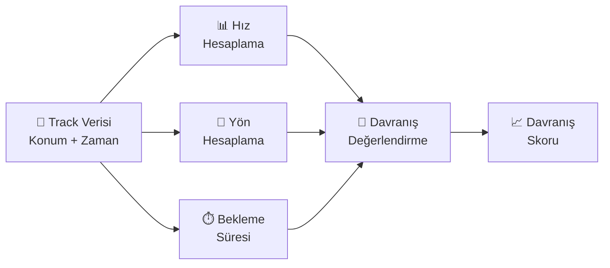

### Davranış Sınıflandırması

| Davranış | Koşul | Skor Etkisi |
|----------|-------|-------------|
| **Normal yürüyüş** | Hız < 5 px/frame, sabit yön | 0.0 |
| **Hızlı hareket** | Hız > 10 px/frame | +0.2 |
| **Uzun bekleme** | Aynı bölgede > 60 sn | +0.15 |
| **Ani yön değişimi** | Yön sapması > 90° | +0.1 |
| **Koşma** | Hız > 20 px/frame | +0.3 |

```python
class MovementAnalyzer:
    def analyze(self, track) -> MovementReport:
        """
        Output: MovementReport
            - speed: float          # Anlık hız
            - avg_speed: float      # Ortalama hız
            - direction: tuple      # (dx, dy) yön vektörü
            - dwell_time: float     # Bekleme süresi (sn)
            - route: list           # Geçilen noktalar
            - behavior_score: float # 0.0 - 1.0 şüphe skoru
            - behavior_label: str   # "normal" / "suspicious" / "running"
        """
```

---

## 🔗 Tracking Pipeline — Uçtan Uca Entegrasyon

> Bu bölüm **Modül 1–5 arası veri akışının** nasıl birleştiğini ve `pipeline.py` orkestratörünün nasıl çalıştığını anlatır.

### Pipeline Akış Diyagramı

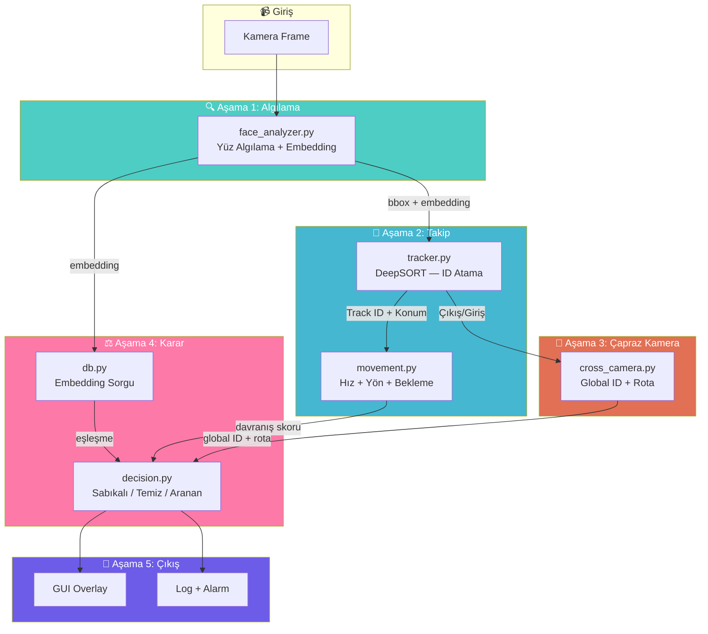

### Her Aşamada Ne Olur?

| Aşama | Dosya | Giriş | Çıkış | Ne Zaman Çalışır |
|-------|-------|-------|-------|-------------------|
| 1 | `face_analyzer.py` | Frame (BGR) | `List[FaceResult]` — bbox, embedding, score | Her frame |
| 2a | `tracker.py` | `List[FaceResult]` | `List[Track]` — track_id, bbox, velocity | Her frame |
| 2b | `movement.py` | `Track` | `MovementReport` — hız, yön, davranış skoru | Track active iken |
| 3 | `cross_camera.py` | Track çıkış/giriş olayı | Global ID, rota geçmişi | Kameradan çıkış/giriş anı |
| 4a | `db.py` | Embedding (512-dim) | `MatchResult` — kişi bilgisi, benzerlik | Track ilk oluştuğunda (**1 kez**) |
| 4b | `decision.py` | Match + Movement + CrossCamera | Karar: TEMİZ/SABIKALI/ARANIYOR | Her track güncellemesinde |
| 5 | GUI + Logger | Karar sonucu | Overlay + log + alarm | Sürekli |

### Track Yaşam Döngüsü

```
Frame 1:  Yüz algılandı → Yeni Track #5 oluştu → DB'de sorgula (1 KEZ)
                                                   ↓
Frame 2-N: Track #5 güncellendi → Konum/hız güncel → DB SORGULANMAZ
                                                   ↓
Frame X:  Track #5 kameradan çıktı → cross_camera'ya bildir
                                                   ↓
Kamera 2: Yeni yüz → embedding karşılaştır → Aynı kişi! → Global ID ata
```

> ⚡ **Kritik Performans Kuralı:** DB sorgusu **sadece yeni track oluştuğunda** yapılır. Aynı kişi kamerada kaldığı sürece tekrar sorgulanmaz. 30 FPS'te saniyede **30 yerine 1 sorgu** = **%97 performans kazancı**.

### Pipeline Orkestratörü — `src/engine/pipeline.py`

```python
class Pipeline:
    """Tüm modülleri birleştiren ana işlem hattı — tek giriş noktası."""

    def __init__(self, config):
        self.face_analyzer = FaceAnalyzer(config.face)
        self.tracker = Tracker(config.tracking)         # Her kamera için ayrı instance
        self.cross_camera = CrossCameraTracker(config.cross_camera)
        self.movement = MovementAnalyzer(config.movement)
        self.db = Database(config.database)
        self.decision = DecisionEngine()

    def process_frame(self, camera_id: str, frame: np.ndarray) -> list[Result]:
        # 1. Yüz algıla
        faces = self.face_analyzer.detect_faces(frame)

        # 2. Tracking güncelle
        tracks = self.tracker.update(camera_id, faces)

        results = []
        for track in tracks:
            # 3. Yeni track ise DB'de sorgula (SADECE 1 KEZ)
            if track.is_new:
                embeddings = self.db.get_all_embeddings()
                match = None
                for cid, emb in embeddings:
                    score = self.face_analyzer.compare(track.face_embedding, emb)
                    if score > self.face_analyzer.threshold:
                        match = MatchResult(criminal_id=cid, confidence=score)
                        break
                track.criminal_match = match

            # 4. Hareket analizi
            movement = self.movement.analyze(track)

            # 5. Kameradan çıkış/giriş kontrolü
            self.cross_camera.check(camera_id, track)

            # 6. Karar ver
            decision = self.decision.evaluate(track, movement)
            results.append(decision)

        return results
```

### Kod Tekrarı Önleme Kuralları

| Kural | Açıklama |
|-------|----------|
| **Cosine similarity tek yerde** | Sadece `FaceAnalyzer.compare()` — DB asla kendi karşılaştırma yapmaz |
| **Config tek yerde** | `utils/config.py` → `AppConfig` sınıfı → tüm modüllere constructor'dan geçirilir |
| **Frame okuma tek yerde** | Sadece `camera_manager.py` frame okur → `pipeline.py`'a gönderir |
| **DB sorgusu tek yerde** | Sadece `pipeline.py` → `db.get_all_embeddings()` çağırır |

---

## 📐 Modül 6: Karar Motoru

### Karar Akışı

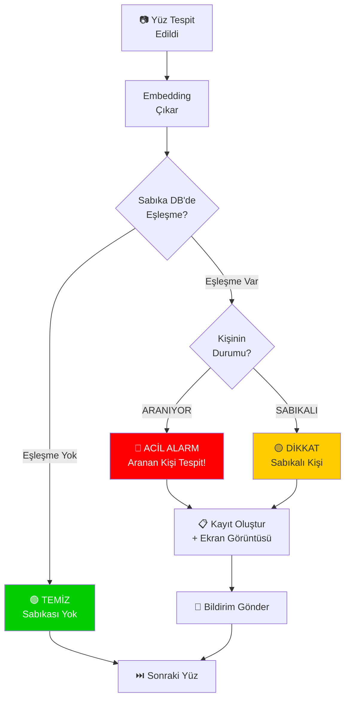

### Sabıka Durumu Sınıflandırması

| Durum | Renk | Eşleşme | Aksiyon |
|-------|------|---------|---------|
| **TEMİZ** | 🟢 Yeşil | DB'de yok | İzlemeye devam |
| **SABIKALI** | 🟡 Sarı | DB'de var, sabıka kaydı mevcut | Log kaydet, dikkat et |
| **ARANIYOR** | 🔴 Kırmızı | DB'de var, aktif arama kaydı | **ACİL ALARM + konum bildir** |
| **BİLİNMEYEN** | ⚪ Gri | Yüz algılandı ama DB'de yok | Kayıt altına al (opsiyonel) |

### Tehlike Seviyeleri

| Seviye | Açıklama | Ör. Suç Türü |
|--------|----------|--------------|
| `LOW` | Düşük risk | Trafik suçu, küçük hırsızlık |
| `MEDIUM` | Orta risk | Dolandırıcılık, uyuşturucu |
| `HIGH` | Yüksek risk | Silahlı soygun, yaralama |
| `CRITICAL` | Kritik risk | Terör, cinayet, organize suç |

---

## 📐 Modül 7: Uygulama Arayüzü

### Ana Ekran — Canlı İzleme

```
┌──────────────────────────────────────────────────────────────────────────────┐
│  🔍 SKYWATCH — Sabıka Sorgulama & Kişi Arama Sistemi        [_] [□] [X]   │
├────────────────────────────────────┬─────────────────────────────────────────┤
│                                    │  📊 Durum Paneli                       │
│   🎬 CANLI GÖRÜNTÜ — CAM_01      │  Aktif Kamera: 4                       │
│                                    │  Taranan Yüz: 847                      │
│   [Yüz çerçeveleri + renk kodu]   │  Sabıkalı Tespit: 2                    │
│                                    │  Aktif Arama: 1                        │
│   👤 🟢  👤 🟢  👤 🔴            │                                         │
│                                    ├─────────────────────────────────────────┤
│                                    │  🔴 Son Alarm                          │
│   ▼ Kamera Seç: [CAM_01 ▾]       │  ┌──────┐                              │
│                                    │  │ FOTO │ Kişi_B                       │
├────────────────────────────────────┤  └──────┘ Suç: Silahlı Soygun         │
│  📋 Olay Akışı                    │  Tehlike: 🔴 CRITICAL                  │
│  14:42 🔴 ARANAN TESPİT! CAM_01  │  Kamera: CAM_01 | 14:42               │
│  14:38 🟡 Sabıkalı tespit CAM_03 │  Benzerlik: %91                        │
│  14:35 🟢 1 yüz tarandı — temiz  │  [📋 Detay]  [📷 Görüntü]  [🔔 Bildir]│
│  14:30 ℹ️ Sistem başlatıldı      │                                         │
└────────────────────────────────────┴─────────────────────────────────────────┘
```

### Aktif Arama Ekranı

```
┌─────────────────────────────────────────────────────────────────────┐
│  🔍 Kişi Arama                                                     │
├─────────────────────────────────────────────────────────────────────┤
│                                                                     │
│  📷 Aranan Kişinin Fotoğrafı:                                      │
│  ┌──────────┐                                                       │
│  │          │  [📁 Dosyadan Yükle]                                  │
│  │  FOTOĞRAF│  [📋 Panodan Yapıştır]                                │
│  │          │                                                       │
│  └──────────┘                                                       │
│                                                                     │
│  🗺️ Arama Alanı Seçimi:                                           │
│  ┌─────────────────────────────────────────────────────────────┐    │
│  │                                                             │    │
│  │    [HARITA / KAMERA KONUMLARI]                              │    │
│  │                                                             │    │
│  │    📍CAM_01 ✅   📍CAM_02 ✅   📍CAM_03 ☐               │    │
│  │                                                             │    │
│  │    📍CAM_04 ☐    📍CAM_05 ☐                               │    │
│  │                                                             │    │
│  │    ── veya ──                                               │    │
│  │    🔲 Bölge Seç: [Bölge A ▾] → (CAM_01, CAM_02, CAM_06)  │    │
│  │                                                             │    │
│  └─────────────────────────────────────────────────────────────┘    │
│                                                                     │
│  ☑ Tüm Kameralarda Ara                                             │
│  ☐ Sadece Seçili Kameralarda Ara                                    │
│  ☐ Bölge Seçimine Göre Ara                                         │
│                                                                     │
│  [🔍 ARAMAYI BAŞLAT]                          [❌ İptal]           │
├─────────────────────────────────────────────────────────────────────┤
│  📊 Arama Durumu: ████████░░░░ %65 — CAM_02 taranıyor...          │
│                                                                     │
│  ✅ CAM_01 — Bulunamadı                                            │
│  🔍 CAM_02 — Taranıyor... (124 yüz tarandı)                       │
│  ⏳ CAM_03 — Sırada                                                │
└─────────────────────────────────────────────────────────────────────┘
```

### Sabıkalı Kayıt Ekleme Ekranı

```
┌─────────────────────────────────────────────────────────┐
│  📝 Sabıkalı Kayıt Ekleme                              │
├─────────────────────────────────────────────────────────┤
│  📷 Fotoğraf:                                           │
│  ┌──────────┐  [📁 Dosyadan Yükle]                     │
│  │          │  [📸 Kameradan Çek]                       │
│  │  YÜZ    │                                            │
│  │  ÖNİZLE │  İsim: [________________]                 │
│  │          │  Cinsiyet: [Erkek ▾]                      │
│  └──────────┘  Yaş: [__]                                │
│                                                         │
│  Suç Türü: [Silahlı Soygun ▾]                         │
│  Tehlike Seviyesi: [CRITICAL ▾]                         │
│  Durum: ○ SABIKALI  ● ARANIYOR                         │
│  Açıklama: [____________________________]              │
│                                                         │
│  [💾 Kaydet]                        [❌ İptal]          │
└─────────────────────────────────────────────────────────┘
```

---

## 📐 Modül 8: Log ve Bildirim Sistemi

### Olay Türleri

| Tür | Açıklama | Aksiyon |
|-----|----------|---------|
| `FACE_SCANNED` | Yüz tarandı, temiz | Log kaydet |
| `CRIMINAL_DETECTED` | Sabıkalı kişi tespit edildi | Log + uyarı |
| `WANTED_FOUND` | Aranan kişi bulundu! | Log + **ACİL ALARM** + ekran görüntüsü |
| `SEARCH_STARTED` | Aktif arama başlatıldı | Log |
| `SEARCH_COMPLETED` | Arama tamamlandı | Log + sonuç raporu |
| `CAMERA_OFFLINE` | Kamera bağlantısı kesildi | Uyarı |

### Otomatik Ekran Görüntüsü Kaydı

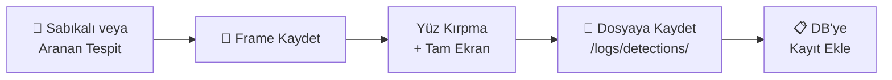

---

## 🛠️ Teknoloji Yığını

| Bileşen | Teknoloji | Neden? |
|---------|-----------|--------|
| **Yüz Algılama** | RetinaFace (InsightFace) | Yüksek doğruluk, çoklu yüz |
| **Yüz Embedding** | ArcFace (InsightFace) | State-of-the-art 512-dim embedding |
| **Tracking** | DeepSORT (deep-sort-realtime) | Güvenilir çoklu nesne takibi |
| **Veritabanı** | SQLite | Hafif, kurulum gerektirmez |
| **Arayüz** | PyQt5 | Profesyonel masaüstü GUI |
| **Dil** | Python 3.10+ | ML ekosistemi |
| **Görüntü İşleme** | OpenCV | Kamera yönetimi, frame işleme |
| **Config** | YAML (PyYAML) | Okunabilir konfigürasyon |
| **Vektör Karşılaştırma** | SciPy / NumPy | Cosine similarity |

### Gerekli Kütüphaneler

```
insightface>=0.7.3         # Yüz algılama + tanıma (RetinaFace + ArcFace)
onnxruntime>=1.16.0        # Model çalıştırma (CPU)
# onnxruntime-gpu          # GPU varsa
opencv-python>=4.8.0       # Görüntü işleme + kamera
numpy>=1.24.0              # Sayısal hesaplama
scipy>=1.10.0              # Cosine similarity
deep-sort-realtime>=1.3    # DeepSORT tracking
PyQt5>=5.15.0              # GUI
pyyaml>=6.0                # Config
Pillow>=9.0                # Görüntü yükleme/kaydetme
```

---

## 📁 Proje Klasör Yapısı (Optimize)

> ⚡ **Mevcut yapıdan farklar:** `face/comparator.py` kaldırıldı (tekrar), `database/models.py` kaldırıldı (`db.py`'ye birleşti), `tracking/` → `core/` altına alındı (az nesting), `data/`, `docs/`, `tests/` klasörleri kaldırıldı (V1'de gereksiz).

```
SKYWATCH/
├── README.md                              # Proje açıklaması + kurulum
├── requirements.txt                       # Python bağımlılıkları
├── SKYWATCH_PROJE_SUNUM.md                # Bu döküman
├── config/
│   └── config.yaml                        # Tek config — TÜM ayarlar burada
├── models/
│   └── buffalo_l/                         # InsightFace yüz tanıma modeli
├── src/
│   ├── main.py                            # Uygulama giriş noktası
│   ├── core/                              # 🧠 Çekirdek AI modülleri
│   │   ├── __init__.py
│   │   ├── face_analyzer.py               # Yüz algılama + embedding + compare (TEK DOSYA)
│   │   ├── tracker.py                     # DeepSORT multi-object tracking
│   │   ├── cross_camera.py                # Kameralar arası takip (Re-ID)
│   │   └── movement.py                    # Hareket analizi (hız, yön, rota)
│   ├── database/
│   │   ├── __init__.py
│   │   └── db.py                          # Tüm DB işlemleri (TEK DOSYA — models birleşik)
│   ├── engine/                            # ⚙️ İş mantığı
│   │   ├── __init__.py
│   │   ├── pipeline.py                    # Ana işlem hattı (frame → sonuç orkestratör)
│   │   ├── camera_manager.py              # Çoklu kamera yönetimi (TEK frame okuma noktası)
│   │   ├── search_engine.py               # Aktif kişi arama motoru
│   │   └── decision.py                    # Karar motoru (sabıkalı/temiz/aranan)
│   ├── gui/                               # 🖥️ Arayüz
│   │   ├── __init__.py
│   │   ├── main_window.py                 # Ana kontrol paneli
│   │   ├── live_view.py                   # Canlı kamera görüntüsü + overlay
│   │   ├── search_panel.py                # Aktif arama paneli
│   │   └── register_panel.py              # Sabıkalı kayıt ekleme
│   └── utils/                             # 🔧 Yardımcılar
│       ├── __init__.py
│       ├── logger.py                      # Event logging + bildirim
│       └── config.py                      # Config yükleyici (tek AppConfig sınıfı)
├── database/
│   ├── skywatch.db                        # SQLite veritabanı
│   └── photos/                            # Sabıkalı yüz fotoğrafları
└── logs/
    ├── events.log                         # Olay kayıtları
    └── detections/                        # Tespit ekran görüntüleri
```

### Neden Bu Yapı?

| Eski | Yeni | Neden |
|------|------|-------|
| `face/analyzer.py` + `face/comparator.py` | `core/face_analyzer.py` | Cosine similarity analyzer içinde — **ayrı dosya gereksiz** |
| `database/db_manager.py` + `database/models.py` | `database/db.py` | SQLite için 2 dosya fazla — **tek dosya yeterli** |
| `tracking/` klasörü (3 dosya) | `core/` altında (3 dosya) | Gereksiz alt klasör kaldırıldı — **daha az nesting** |
| `camera/camera_manager.py` | `engine/camera_manager.py` | Tek dosya için ayrı klasör gereksiz |
| `search/person_search.py` | `engine/search_engine.py` | Tek dosya için ayrı klasör gereksiz |
| `decision/decision_engine.py` | `engine/decision.py` | Tek dosya için ayrı klasör gereksiz |
| `utils/notifier.py` + `utils/config_loader.py` | `logger.py` + `config.py` | Bildirim log ile birleşti, isimler kısaldı |
| `data/` (sample_videos + camera_config) | ❌ **Kaldırıldı** | `config.yaml` kamera ayarlarını içeriyor, test verileri projede olmaz |
| `docs/` (architecture + test_report) | ❌ **Kaldırıldı** | Bu döküman + README yeterli |
| `tests/` (7 dosya) | ❌ **Kaldırıldı** | V1'de gereksiz — geliştirme sırasında eklenecek |
| `gui/detection_detail.py` | ❌ **Kaldırıldı** | `live_view.py` içinde popup olarak gösterilebilir |

> 📊 **Sonuç:** Klasör: 13 → 8 | Dosya: ~25 → ~17 | Hiçbir fonksiyonellik kaybı yok

---

## ⚙️ Config Dosyası (`config/config.yaml`)

```yaml
cameras:
  - id: "CAM_01"
    name: "Ana Giriş"
    source: 0
    location: "Bina A — Giriş"
    region: "BOLGE_A"
    neighbors: ["CAM_02"]             # Komşu kameralar (cross-camera için)
  - id: "CAM_02"
    name: "Koridor"
    source: "rtsp://192.168.1.100:554/stream"
    location: "Bina A — Koridor"
    region: "BOLGE_A"
    neighbors: ["CAM_01", "CAM_03"]
  - id: "CAM_03"
    name: "Otopark"
    source: "videos/otopark.mp4"
    location: "Dış Alan — Otopark"
    region: "BOLGE_B"
    neighbors: ["CAM_02"]

regions:
  BOLGE_A:
    name: "Ana Bina"
    cameras: ["CAM_01", "CAM_02"]
  BOLGE_B:
    name: "Dış Alan"
    cameras: ["CAM_03"]

face:
  recognition_model: "buffalo_l"
  similarity_threshold: 0.45
  min_face_size: 30
  scan_interval_ms: 500

tracking:
  max_age: 30                          # Track kaybolma süresi (frame)
  min_hits: 3                          # Minimum tespit sayısı
  iou_threshold: 0.3                   # IOU eşleşme eşiği

cross_camera:
  enabled: true
  exit_buffer_seconds: 30              # Çıkan kişiyi kaç sn hatırla
  similarity_threshold: 0.45           # Cross-camera eşleşme eşiği

movement:
  speed_threshold_fast: 10             # Hızlı hareket (px/frame)
  speed_threshold_running: 20          # Koşma (px/frame)
  dwell_time_threshold: 60             # Şüpheli bekleme süresi (sn)
  direction_change_threshold: 90       # Ani yön değişimi (derece)

database:
  path: "database/skywatch.db"
  criminal_photos_dir: "database/criminal_photos/"

search:
  max_concurrent_cameras: 4
  timeout_minutes: 30
  auto_expand_neighbors: true          # Bulunduğunda komşu kameraları otomatik tara

logging:
  log_dir: "logs/"
  save_detection_screenshots: true
  screenshot_dir: "logs/detections/"

notifications:
  sound_alarm: true
  popup_alert: true
```

---

## 🚀 Optimize Yol Haritası (12 Hafta)

> 📊 Mevcut plandan **2 hafta kısa** — gereksiz dosyalar ve tekrar eden yapılar temizlendiği için.

---

### 📌 AŞAMA 1: Ortam & Temel Altyapı (Hafta 1)

**Hedef:** Proje yapısı + Python ortamı + config sistemi

#### Yapılacaklar:
1. Python 3.10+ sanal ortam kurulumu
2. `requirements.txt` oluşturma + kütüphane yüklemeleri
3. Optimize klasör yapısını oluşturma (yukarıdaki yapı)
4. `config.yaml` + `utils/config.py` (AppConfig sınıfı)
5. `utils/logger.py` — temel log sistemi

#### Oluşturulacak Dosyalar:
- `requirements.txt`, `config/config.yaml`
- `src/utils/config.py`, `src/utils/logger.py`
- Tüm `__init__.py` dosyaları

#### ✅ Tamamlanma Kriteri:
- `python src/main.py` çalışıyor
- Config yükleniyor, log yazılıyor

---

### 📌 AŞAMA 2: Yüz Algılama + Embedding (Hafta 2–3)

**Hedef:** InsightFace ile yüz algılama ve embedding çıkarma

#### Yapılacaklar:
1. InsightFace entegrasyonu → `src/core/face_analyzer.py`
2. `FaceAnalyzer` sınıfı: `detect_faces()`, `extract_embedding()`, `compare()`
3. Tek kameradan canlı yüz algılama demo
4. Kamera yöneticisi → `src/engine/camera_manager.py`

#### ✅ Tamamlanma Kriteri:
- Kameradan yüzler algılanıyor + embedding üretiliyor
- `compare()` ile iki yüz karşılaştırılıyor
- Yüz çerçevesi çiziliyor

---

### 📌 AŞAMA 3: Veritabanı + Eşleştirme (Hafta 4)

**Hedef:** SQLite veritabanı + sabıka eşleştirme

#### Yapılacaklar:
1. `src/database/db.py` — tek dosyada tüm CRUD
2. Tabloları oluştur: CRIMINALS, EMBEDDINGS, DETECTIONS, SEARCH_REQUESTS
3. Pipeline entegrasyonu: kamera → yüz → DB sorgu → sonuç
4. `src/engine/decision.py` — temel karar motoru

#### ⚠️ Kod Tekrarı Kontrolü:
- DB **sadece embedding döndürür**, karşılaştırma `FaceAnalyzer.compare()` yapar
- Cosine similarity kodu **tek yerde** kalır

#### ✅ Tamamlanma Kriteri:
- Sabıkalı kaydı ekleniyor + embedding kaydediliyor
- Kameradaki yüzler DB'de aranıyor
- Sabıkalı tespit edildiğinde konsola uyarı basılıyor

---

### 📌 AŞAMA 4: Tracking Core + Pipeline (Hafta 5–6)

**Hedef:** DeepSORT tracking + hareket analizi + pipeline orkestratör

#### Yapılacaklar:
1. `src/core/tracker.py` — DeepSORT entegrasyonu
2. `src/core/movement.py` — hız, yön, bekleme süresi analizi
3. `src/engine/pipeline.py` — **ana orkestratör** (yukarıdaki pipeline diyagramı)
4. Track → yüz tanıma bağlantısı (ilk frame'de 1 kez DB sorgusu)

#### ⚠️ Kritik Performans Kuralı:
- DB sorgusu **sadece `track.is_new` olduğunda** çağrılır
- Frame okuma **sadece `camera_manager.py`** üzerinden

#### ✅ Tamamlanma Kriteri:
- Kişiler sabit Track ID ile takip ediliyor
- Aynı kişi için DB tekrar sorgulanmıyor (%97 performans kazancı)
- Hız ve yön bilgisi hesaplanıyor
- Pipeline tüm modülleri doğru sırada çağırıyor

---

### 📌 AŞAMA 5: Multi-Camera + Aktif Arama (Hafta 7–8)

**Hedef:** Kameralar arası takip ve hedef kişi arama

#### Yapılacaklar:
1. `src/core/cross_camera.py` — embedding bazlı çapraz kamera eşleştirme
2. `src/engine/search_engine.py` — aktif arama motoru
3. Kamera/bölge seçim mekanizması
4. Rota takibi — kişinin kameralar arası geçiş kaydı
5. Pipeline'a cross-camera + search entegrasyonu

#### ✅ Tamamlanma Kriteri:
- Kişi kameralar arasında global ID ile takip ediliyor
- Fotoğraf yükleyerek arama başlatılabiliyor
- Bulunduğunda komşu kameralar otomatik taranıyor

---

### 📌 AŞAMA 6: GUI Arayüz (Hafta 9–11)

**Hedef:** Tam fonksiyonlu PyQt5 arayüzü

#### Yapılacaklar:
1. `gui/main_window.py` — ana kontrol paneli (canlı izleme + durum + log)
2. `gui/live_view.py` — canlı görüntü + tracking overlay (ID, hız, yön, renk kodu)
3. `gui/register_panel.py` — sabıkalı kayıt ekleme
4. `gui/search_panel.py` — aktif arama (fotoğraf + kamera/bölge seçimi)
5. Cross-camera rota gösterimi
6. Alarm bildirimleri (ses + popup)

#### ✅ Tamamlanma Kriteri:
- Arayüz üzerinden tüm fonksiyonlar kullanılabiliyor
- Canlı görüntüde tracking overlay gösteriliyor
- Arama + rota takibi çalışıyor
- Alarm sistemi aktif

---

### 📌 AŞAMA 7: Entegrasyon Test + Polish (Hafta 12)

**Hedef:** Uçtan uca test ve sunum hazırlığı

#### Test Senaryoları

| # | Senaryo | Beklenen Sonuç |
|---|---------|---------------|
| 1 | Sabıkalı kişinin kamera önünden geçmesi | 🔴 Alarm + kayıt |
| 2 | Temiz kişinin kamera önünden geçmesi | 🟢 Temiz |
| 3 | Aynı kişi farklı kameralarda görülmesi | Aynı global ID + rota kaydı |
| 4 | Fotoğraf ile arama başlatma | Doğru kamerada bulma |
| 5 | Bölge seçerek arama | Sadece o bölgedeki kameralarda tarama |
| 6 | Hızlı hareket eden kişi | Davranış skoru yükselir |
| 7 | Kişinin kameralar arası geçişi | Cross-camera eşleşme + rota |
| 8 | 30+ dakika kesintisiz çalışma | Kararlılık testi |

---

## 📊 Performans Metrikleri

| Metrik | Hedef | Nasıl Ölçülecek |
|--------|-------|-----------------|
| **Yüz Algılama Doğruluğu** | ≥ 95% | Doğru algılama / toplam yüz |
| **Yüz Eşleştirme Doğruluğu** | ≥ 90% | Doğru eşleşme / toplam sorgu |
| **False Positive Oranı** | < 5% | Yanlış alarm / toplam tarama |
| **Tracking Tutarlılığı** | ≥ 85% | ID switch oranı (MOTA) |
| **Cross-Camera Eşleşme** | ≥ 80% | Doğru kameralar arası eşleşme |
| **Arama Süresi (tek kamera)** | < 3 sn | Fotoğraf yükleme → sonuç |
| **Sistem Gecikmesi** | < 500ms | Yüz algılamadan sonuca |
| **Eşzamanlı Kamera** | ≥ 4 | Aynı anda işlenen kamera sayısı |

---

## ⏱️ Zaman Çizelgesi

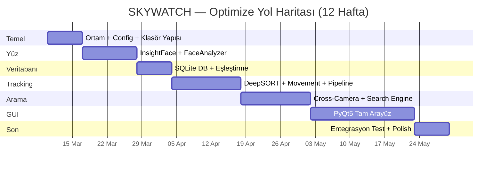

---

## 🎓 CV'de Nasıl Yazacaksın

```
SKYWATCH – AI-Based Criminal Record Verification & Person Search System
• Designed a real-time face recognition system using InsightFace (ArcFace + RetinaFace)
  for automated criminal record checking across multiple camera feeds
• Implemented DeepSORT multi-object tracking with cross-camera Re-ID
  using face embeddings for seamless person tracking across camera networks
• Built movement analysis module computing velocity, direction, dwell time,
  and behavioral scoring for suspicious activity detection
• Built dual-mode operation: passive surveillance with instant database matching,
  and active person search with region/camera-based targeting
• Developed professional PyQt5 control panel with live camera feed, tracking overlay,
  cross-camera route visualization, and intelligent alert system
Tech: Python, InsightFace/ArcFace, DeepSORT, OpenCV, PyQt5, SQLite, NumPy
```

---

## 🔮 V2 — Gelecekte Eklenebilir Gelişmiş Özellikler

> Aşağıdaki özellikler mevcut mimariye **modüler olarak** eklenebilecek şekilde tasarlanmıştır. V1 tamamlandıktan sonra geliştirme aşamasına alınacaktır.

### 🛡️ Liveness Detection (Sahte Yüz Tespiti)

Biri **fotoğraf, video replay veya maske** göstererek sistemi kandırabilir. Bu modül sahte yüz girişimlerini tespit eder.

| Saldırı Türü | Tespit Yöntemi |
|-------------|---------------|
| **Fotoğraf** | Göz kırpma algılama (blink detection) — fotoğrafta göz kırpmaz |
| **Video Replay** | Texture analizi — ekran piksel yapısını algılar |
| **3D Maske** | Depth estimation — derinlik haritası ile gerçek yüz/maske ayırt etme |

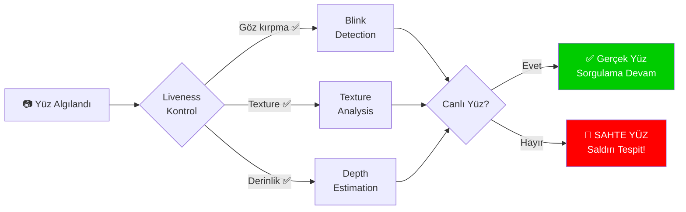

**Teknik Yaklaşımlar:**
- **Blink Detection:** Eye Aspect Ratio (EAR) ile göz açıklık oranı takibi
- **Texture Analysis:** LBP (Local Binary Patterns) veya CNN tabanlı texture sınıflandırma
- **Depth Estimation:** Monocular depth veya stereo kamera ile 3D derinlik haritası

> **Not:** Bu modül V2 kapsamındadır. Mevcut sistem mimarisine `src/face/liveness.py` olarak eklenebilir.

### Diğer V2 Özellikleri

| Özellik | Açıklama |
|---------|----------|
| **Web Dashboard** | Flask/FastAPI + React ile web arayüzü |
| **Harita Gösterimi** | Kişilerin konumlarını 2D harita üzerinde gösterme |
| **Anomali Tespiti** | Normal dışı davranış örüntülerini otomatik algılama |
| **Gelişmiş Raporlama** | Günlük/haftalık güvenlik raporu üretimi |

---

## 📚 Referans Kaynaklar

| Kaynak | Açıklama |
|--------|----------|
| [InsightFace](https://github.com/deepinsight/insightface) | Yüz tanıma (ArcFace + RetinaFace) |
| [DeepSORT](https://github.com/nwojke/deep_sort) | Çoklu nesne takibi |
| [OpenCV](https://docs.opencv.org/) | Görüntü işleme + kamera yönetimi |
| [PyQt5](https://www.riverbankcomputing.com/software/pyqt/) | GUI framework |
| [SQLite](https://www.sqlite.org/) | Gömülü veritabanı |
| [LFW Benchmark](http://vis-www.cs.umass.edu/lfw/) | Yüz tanıma doğruluk testi |

---

> **Not:** Bu proje savunma ve güvenlik alanında yüz tanıma teknolojisinin pratik uygulamasını göstermektedir. Tüm testler kontrollü ortamda, izinli katılımcılarla yapılacaktır. V2 özellikleri (Liveness Detection vb.) mevcut mimariye modüler olarak eklenebilir yapıdadır.

